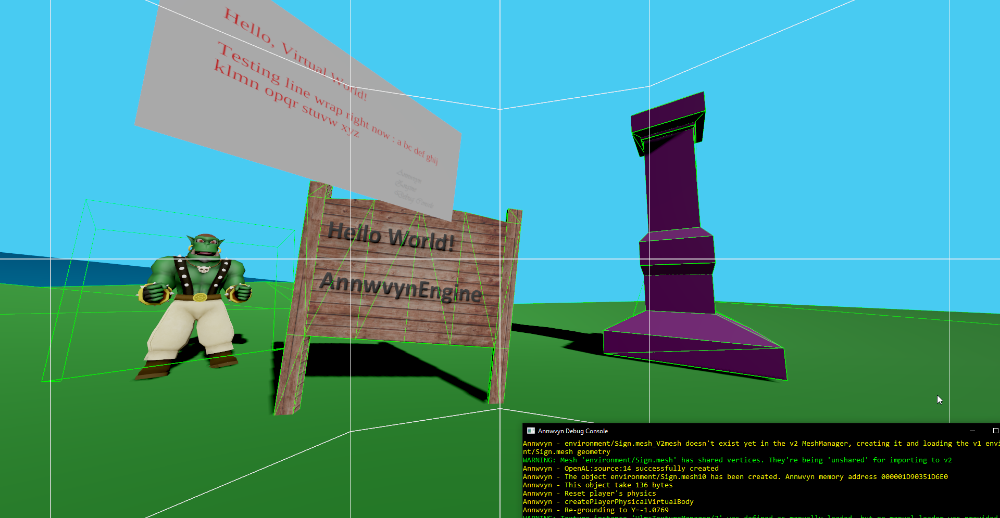

Annwvyn
=======

Annwvyn Engine is a simple C++ game engine built upon free and open source technologies to easily create applications and games using Virtual Reality HMD.
Freely distributed under the MIT license.

For any questions, shout me a mail at developer@annwvyn.org, or at ybalrid@ybalrid.info

Currently the engine supports :
 - Oculus Rift through the Oculus SDK
 - OpenVR
     - HTC Vive
     - Oculus Rift (You can use the Oculus Rift with SteamVR, but the "native" way is recommended)
     - Any headset officially supported by SteamVR

It uses Ogre for rendering to OpenGL buffers that are given to each VR libraries, Bullet for simulating physics and collisions and OpenAL for spatialized audio playback.

Please read the DEPENDENCIES file to know what you need to build it.

System and Software requirement
-------------------------------

 - A fairly recent GPU. Support for OpenGL **4.3** is **required**. This is also a requirement from VR hardware vendor
 - Oculus VR Headset (Rift) CV1 or Dev Kit 2 OR HTC Vive, or other hardware supported by OpenVR
 - Usable with hand controllers (touch, vive wands...) 
 - 64bit Operating system
 - Up to date runtime software: 
    - Oculus Home app installed from http://oculus.com/setup 
    - SteamVR installed through Steam http://steampowered.com/
 - Microsoft Visual Studio 2017 Community (free to download and use from Microsoft)
 
 Specifically, the code needs a C++14 compliant compiler, and the dependency package is built with the lattest version of Visual Studio available (15.4.1)
 
Installation
------------

First, please install Visual Studio 2017 (the community version is free) from Microsoft.

Then, go get the SDK installer here https://www.annwvyn.org/download/ and run it. 
If near the end of the installer, a CMD window open asking about setting up environment variables, say yes.

This is due to the fact that the build configuration file need to locate the SDK installation directory.

After that, if you need to update the engine to the current master branch, see the "Updating the engine" section below.

Building on Windows
-------------------
**Please install Oculus Home, or SteamVR and the lattest drivers from your graphics card manufacturer.**

As stated in the DEPEDENCIES file, you should download the SDK from https://annwvyn.org/
The SDK has everything to **build** Annwwvyn itself, so you can hack into it by this way to. It's a Source+Binary package.

But, if you *really* want to build and setup the engine yourself, here's a simple guide how to do it

- Download the "dependency package" from here https://www.annwvyn.org/download/
- Extract it in a folder
- Clone this repo in the same folder
- Run the "RUNME.BAT" script from this folder
- Generate in a "build" directirory a VS2017 x64 solution from the root CMakeFiles.txt
- Make sure the IDE is set to build in "release" "x64" mode
- hit Ctrl+Shift+B to build the whole solution
- In the solution explorer, build the install target
- Do the same (without the install part) in the example subdirectory
- You need to copy a bunch of .dll in the "example" (and template) build directories. You can do this automatically by launching the "getLibs.bat" script *(you really should)*. But here's the list if you want to check
    - Ogre  
        - OgreMain.dll
        - OgreOverlay.dll 
        - OgreHlmsPbs.dll
        - OgreHlmsUnlit.dll
        - RenderSystem_GL.dll
        - OIS.dll
    - OpenAL
        - OpenAL32.dll
    - GLEW
        - glew32.dll        
    - sndfile
        - libsndfile-1.dll
    - OpenVR API client
        - openvr_api.dll

If you have an Oculus Rift plugged in (or in Debug HMD mode), or a Vive with SteamVR open you can launch the example program via the HMD_launcher.bat scripts in the example directory. (using the one that correspond to your hardware)

Using the engine
----------------

Make a copy of the "template" directory to a convenient location for you, and you are ready to go. It contains a CMakeLists.txt that will permit you to generate build files for it (VS2015 64bit) 

**Make sure to put Visual Studio build in release/x64 mode before building!** The debug mode target will work but you need ot copy over debug-compatible version of the libraries. They aren't packaged conviniently for that yet. (comming soon).

On windows you need to have a environment variable "AnnwvynSDK64" set to the SDK location. This is done automatically by the SDK installer, but if you encounter problem, you should run again the RUNME.bat script on the SDK installation folder

Updating the engine
-------------------

Run "git pull" on the Annwvyn sub-directory. then open the VS solution in msvc/Annwvyn/Annwyvn.sln
(You may also need to re-build Ogre v2-1 from sources and put it inside your dependency package...)

Clean and build the solution.

If you have build errors, you should download the newest SDK and put it in place of the older one. You can also replace the content of your SDK folder (except the Annwvyn directory) with the dependency package from https://www.annwvyn.org/download/

If you are getting error regarding functions with names that start's with "VR", you need to upgrade the OpenVR package. Just git pull from the OpenVR directory and copy over the dll.

If you are getting errors regarding functions with names that starts with "ovr_", you need to upgrade the OculusSDK. This require you to rebuild the libtray with /MD(d) runtime linkage, but I'll recomedn you to get the new dependency package.
______

If you want more information about the project, please consult the official website (https://annwvyn.org/). It also contains documentation about the code.

This project is in it's really early phases of development. If you have any question, feel free to contact me directly at ybalrid@ybalrid.info 

License MIT.

______

Some words on the linux support
------------------------------

The engine is buildable and runnable under linux, but there is **no support** for any HMD under linux at this time. So games using it will only start in **NoVR** mode. (This may change if we add OSVR support, or if Ogre starts rendering with Vulkan...)

